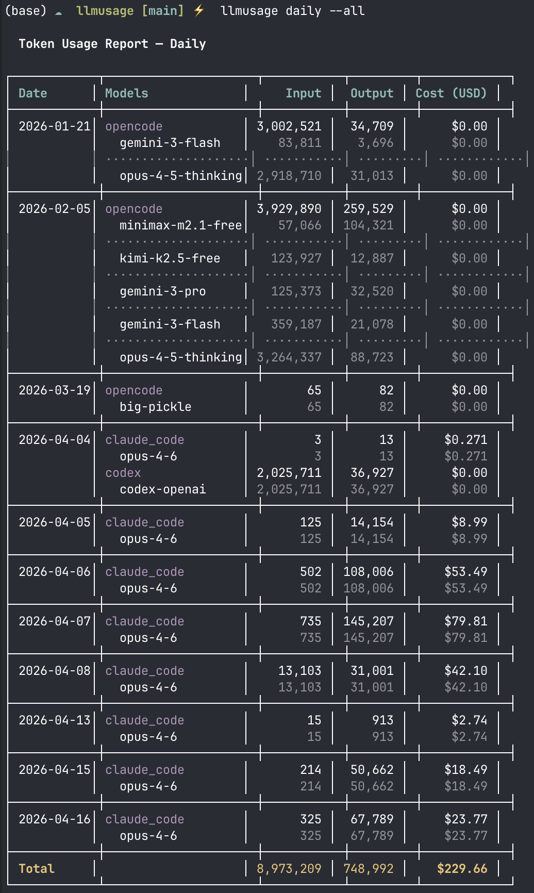

[](https://github.com/openrijal/llmusage/actions/workflows/ci.yml)
[](https://crates.io/crates/llmusage)
[](LICENSE)
[](https://crates.io/crates/llmusage)

# llmusage

Track token usage and costs across AI providers and coding tools from a single CLI.

## What it does

llmusage collects usage data from multiple AI sources — API dashboards, local session logs — normalizes it into a unified SQLite database, and provides fast CLI queries for reporting and cost analysis.

**Supported providers:**

| Provider | Type | Config required |
|----------|------|-----------------|
| Claude Code | Local logs (`~/.claude/projects/`) | None (auto-detect) |
| Codex | Local logs (`~/.codex/archived_sessions/`) | None (auto-detect) |
| Cursor | Local SQLite (`<config_dir>/Cursor/User/globalStorage/state.vscdb`) | None (auto-detect) |
| OpenCode | Local SQLite (`~/.local/share/opencode/opencode.db`) | None (auto-detect) |
| Gemini CLI / Antigravity | Local logs (`~/.gemini/tmp/`) | None (auto-detect) |
| Anthropic API | REST API | `anthropic_api_key` |
| OpenAI API | REST API | `openai_api_key` |
| Gemini API | REST API | `gemini_api_key` (stub) |
| Ollama | REST API | None (defaults to `localhost:11434`) |

**Strict-mode limitations:**

- `windsurf` is intentionally not supported yet. The local artifacts investigated on macOS did not expose reliable token counts.
- `vscode` is intentionally not supported as a generic collector. Installed AI extensions exposed session/model metadata, but not token counts.
- `antigravity` is accepted as a provider alias for `gemini_cli`. Legacy Antigravity `.pb` sessions remain unsupported; only Gemini CLI JSONL sessions are collected.

## Installation

### Install script (recommended on Linux and macOS)

One-liner that downloads the right prebuilt binary for your platform and drops it into a bin directory. No Rust toolchain, no C compiler, no build step:

```bash
curl -LsSf https://raw.githubusercontent.com/openrijal/llmusage/main/install.sh | sh
```

The script installs to `/usr/local/bin` when run as root, otherwise to `$HOME/.local/bin`. Override with `LLMUSAGE_INSTALL_DIR=/your/path`, or pin a version with `LLMUSAGE_VERSION=v0.1.2`. Supports macOS (Intel & Apple Silicon) and Linux (x86_64 glibc/musl, aarch64).

### From Homebrew (macOS)

```bash
brew install openrijal/tap/llmusage
```

### From crates.io

```bash
cargo install llmusage
```

This route compiles from source and needs the [Rust toolchain](https://rustup.rs/) plus a working C compiler (`build-essential` on Debian/Ubuntu, `base-devel` on Arch, `build-base` on Alpine, Xcode Command Line Tools on macOS) because `rusqlite` bundles SQLite. If you don't want to install a C toolchain, use the install script above or Homebrew instead.

### Pre-built binaries

Download the tarball for your platform directly from [GitHub Releases](https://github.com/openrijal/llmusage/releases).

Available for: macOS (Intel & Apple Silicon), Linux (x86_64 glibc, x86_64 musl, aarch64).

### Build from source

```bash
git clone https://github.com/openrijal/llmusage.git
cd llmusage
cargo build --release
# Binary at ./target/release/llmusage
```

Or install directly from the local checkout:

```bash
cargo install --path .
```

Verify the installation:

```bash
llmusage --version
```

## Quick start

```bash
# Configure an API provider (optional — local tools are auto-detected)
llmusage config --set anthropic_api_key=sk-ant-...

# Or prefer environment variables for secrets
export ANTHROPIC_API_KEY=sk-ant-...
export OPENAI_API_KEY=sk-...

# Sync usage data from all configured/detected providers
llmusage sync

# View a summary of the last 30 days
llmusage summary

# Daily breakdown for the last 90 days
llmusage daily
```

## Commands

### Sync

Pull usage data from all configured and auto-detected providers.

```bash
llmusage sync                    # all providers
llmusage sync --provider claude_code  # specific provider only
llmusage sync --provider antigravity  # alias for gemini_cli
```

### Summary

Aggregated usage by provider and model.

```bash
llmusage summary                 # last 30 days
llmusage summary --days 7        # last 7 days
llmusage summary --provider anthropic
llmusage summary --model opus
```

### Daily / Weekly / Monthly

Time-series usage breakdowns.

```bash
llmusage daily                   # last 90 days
llmusage daily --days 30 --json  # JSON output
llmusage weekly --weeks 12
llmusage monthly --months 6 --provider openai
```

### Detail

Per-record breakdown with filtering.

```bash
llmusage detail                          # last 50 records
llmusage detail --model opus --limit 100
llmusage detail --since 2025-01-01 --until 2025-01-31
llmusage detail --provider claude_code
```

### Models

List known models and their pricing (per-million tokens).

```bash
llmusage models
llmusage models --provider anthropic
```

### Export

Export usage data as CSV or JSON.

```bash
llmusage export                          # CSV to stdout
llmusage export --format json --output usage.json
llmusage export --days 7 --output week.csv
```

### Configuration

```bash
llmusage config                          # show current config
llmusage config --set anthropic_api_key=sk-ant-...
llmusage config --set openai_api_key=sk-...
llmusage config --set ollama_host=http://192.168.1.10:11434
llmusage config --set claude_code_enabled=false
```

`llmusage config --list` also shows auto-detected local collectors and strict-mode unsupported local IDE tooling such as Windsurf and VS Code.

Environment variables override config file values when present:

```bash
export ANTHROPIC_API_KEY=sk-ant-...
export OPENAI_API_KEY=sk-...
export GEMINI_API_KEY=AIza...
export OLLAMA_HOST=http://192.168.1.10:11434
```

This is the preferred way to provide API keys because secrets do not need to be written to disk.

For local SQLite IDE collectors that live under a platform config directory:

- **macOS**: `<config_dir>` resolves to `~/Library/Application Support`
- **Linux**: `<config_dir>` resolves to `~/.config`

### Update pricing

Refresh the LiteLLM pricing cache (900+ models).

```bash
llmusage update-pricing
```

Pricing is auto-fetched on first sync. The cache is stored at `~/.cache/llmusage/litellm_pricing.json`.

## Configuration file

TOML config at platform-specific location:

- **macOS**: `~/Library/Application Support/llmusage/config.toml`
- **Linux**: `~/.config/llmusage/config.toml`

| Key | Description | Default |
|-----|-------------|---------|
| `db_path` | SQLite database path | `<config_dir>/llmusage.db` |
| `anthropic_api_key` | Anthropic Admin API key | None |
| `openai_api_key` | OpenAI API key | None |
| `gemini_api_key` | Gemini API key | None |
| `ollama_host` | Ollama server URL | `http://localhost:11434` |
| `claude_code_enabled` | Parse Claude Code session logs | `true` |

On Unix, `llmusage` restricts `config.toml` permissions to `0600` when it reads or writes the file. Existing API key fields still work, but environment variables are safer for secrets.

## Uninstall

```bash
# If installed via the install script (default location)
rm "$HOME/.local/bin/llmusage"   # or /usr/local/bin/llmusage when installed as root

# If installed via cargo
cargo uninstall llmusage

# If installed via Homebrew
brew uninstall llmusage
```

To remove all data and configuration:
- **macOS**: `rm -rf ~/Library/Application\ Support/llmusage`
- **Linux**: `rm -rf ~/.config/llmusage`

## Screenshots

### Daily usage with provider grouping



## Architecture

```
CLI (clap)
  |
SQLite DB (dedup index, WAL mode)
  |
Collectors (one per source, async)
  ├── claude_code   ~/.claude/projects/**/*.jsonl
  ├── codex         ~/.codex/archived_sessions/*.jsonl
  ├── cursor        <config_dir>/Cursor/.../state.vscdb
  ├── opencode      ~/.local/share/opencode/opencode.db
  ├── gemini_cli    ~/.gemini/tmp/**/chats/*.jsonl
  ├── anthropic     /v1/organizations/usage
  ├── openai        /v1/organization/usage
  ├── gemini        (stub)
  └── ollama        /api/ps
```

## Tech stack

| Crate | Purpose |
|-------|---------|
| clap | CLI parsing (derive macros) |
| tokio | Async runtime |
| reqwest | HTTP client |
| rusqlite | SQLite (bundled) |
| serde / serde_json | Serialization |
| chrono | Date/time |
| tabled | Table rendering |
| colored | Terminal colors |
| toml | Config parsing |
| dirs | Platform directories |

## License

MIT
